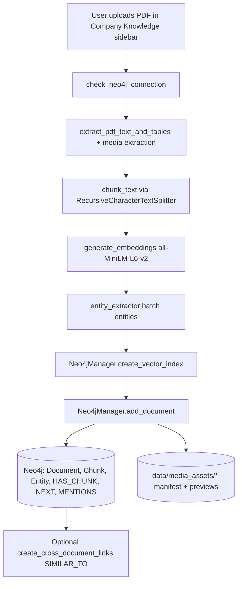
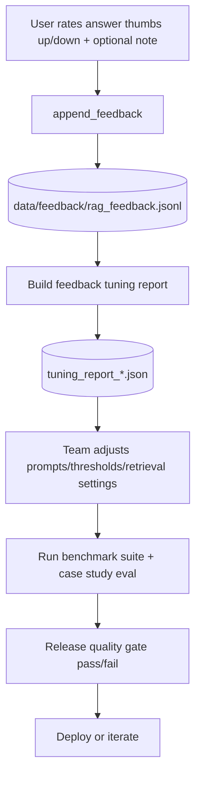

# Pharma Knowledge Hub - Technical Architecture

This document explains the full runtime chain for the current POC: ingestion, retrieval, generation, validation, feedback, and release quality gating.

> **AIOps / Langfuse layer diagram (4-layer, MLOps-style):** see [`docs/AIOPS_ARCHITECTURE.md`](docs/AIOPS_ARCHITECTURE.md)

## 1) System Overview

The app has two answer paths:

- **Chatbot path** (`tabs/chatbot.py`): general pharma assistant using Groq LLM, no document retrieval.
- **Company Knowledge path** (`tabs/company_knowledge.py`): Agentic RAG over uploaded PDFs stored in Neo4j.

Core control points are in `config.py` and Streamlit session state.

## 2) High-Level Module Map

```text
app.py
  -> Sidebar navigation + theme + global guardrail toggle
  -> routes to tabs/*

tabs/company_knowledge.py
  -> upload + ingest workflow
  -> agentic retrieval orchestration
  -> answer generation + validation + critic loop
  -> feedback save

utils/rag_pipeline.py
  -> parse/chunk/embed/extract entities
  -> Neo4j writes and retrieval context builder

utils/neo4j_manager.py
  -> graph persistence, vector query, hybrid fallback

utils/agentic_rag.py
  -> clarifier, rewriter, planner, relevance gate, Groq chat helpers

utils/answer_validator.py
  -> confidence + grounding checks

utils/feedback_store.py + utils/feedback_tuning_report.py
  -> JSONL feedback + offline tuning reports

utils/benchmark_runner.py + tests/case_study_eval.py + tests/release_quality_gate.py
  -> benchmark artifacts + pass/fail release gate
```

## 3) Ingestion Flow (PDF -> Neo4j)



## 4) Query Orchestration Flow (Company Knowledge)

```mermaid
flowchart TD
    U[User question] --> C1{Agentic enabled?}
    C1 -->|No| R0[get_rag_context(question)]
    C1 -->|Yes| A1[Clarifier heuristic]
    A1 -->|Ambiguous| A2[Ask clarification question and stop]
    A1 -->|Clear| A3[Rewrite query for retrieval]
    A3 --> A4[Create retrieval plan]
    A4 --> R1[get_rag_context(rewritten_query)]
    R1 --> A5[Relevance gate YES/NO]
    A5 -->|NO| R2[Retry retrieval with original question]
    A5 -->|YES| G1
    R2 --> G1[Context ready]
    R0 --> G1
    G1 --> Z1{Context empty?}
    Z1 -->|Yes| Z2[Show no-doc answer + 2-line general context tail]
    Z1 -->|No| L1[Groq answer generation]
    L1 --> V1{Validation enabled?}
    V1 -->|No| OUT[Render answer]
    V1 -->|Yes| V2[validate_answer confidence/citations/grounding]
    V2 --> V3{Below threshold?}
    V3 -->|No| OUT
    V3 -->|Yes| V4[critic revision loop]
    V4 --> V5{Recovered confidence?}
    V5 -->|Yes| OUT
    V5 -->|No + strict mode| V6[Abstain grounded answer + general context tail]
    V6 --> OUT
```

## 5) Retrieval Internals

`get_rag_context()` path:

1. Encode query with `sentence-transformers/all-MiniLM-L6-v2`.
2. Run Neo4j vector search (`db.index.vector.queryNodes`).
3. Build multi-doc context with source tags and optional `NEXT` continuation chunks.
4. If vector retrieval fails or is weak, fallback to `_get_context_hybrid()` keyword retrieval.
5. Return combined context text to the answer step.

## 6) Models and Their Roles

- **Embeddings**: `sentence-transformers/all-MiniLM-L6-v2`
  - Used for chunk and query vectors.
- **Fast orchestration calls**: `llama-3.1-8b-instant`
  - Clarifier, rewriter, planner, relevance yes/no judge, general-context tail.
- **Main answer model**: `llama-3.3-70b-versatile`
  - Final user-facing response generation and critic revision.

## 7) Data Storage and Artifacts

### Neo4j (online runtime store)

- `Document` nodes: filename, upload date, type, chunk/media counts.
- `Chunk` nodes: text + embedding + chunk index.
- `Entity` nodes: extracted entities and mention counts.
- Relationships: `HAS_CHUNK`, `NEXT`, `MENTIONS`, optional `SIMILAR_TO`.

### Local filesystem artifacts

- `data/media_assets/*`: extracted table/image/snippet manifests for preview.
- `data/feedback/rag_feedback.jsonl`: thumbs up/down feedback rows.
- `data/feedback/tuning_report_*.json`: offline feedback analysis summaries.
- `data/benchmarks/benchmark_*.json|csv`: benchmark latency/capacity snapshots.
- `data/benchmarks/case_eval_*.json`: case-study retrieval regression evaluation.

## 8) Feedback and Improvement Loop



Important: this loop is **configuration/prompt/retrieval optimization**, not automatic online model weight fine-tuning.

## 9) Release Gate Logic

`tests/release_quality_gate.py` checks latest benchmark and case-eval artifacts:

- `case_pass_rate >= QUALITY_MIN_CASE_PASS_RATE`
- `retrieval_p95_ms <= QUALITY_MAX_RETRIEVAL_P95_MS`

If either fails, gate returns FAIL (non-zero exit code).

## 10) Chatbot vs Company Knowledge (Separation)

- **Chatbot**:
  - Uses Groq only, general pharma knowledge mode.
  - Guardrail can enforce pharma-only response policy.
  - No Neo4j retrieval.

- **Company Knowledge**:
  - Uses uploaded-doc retrieval from Neo4j.
  - Agentic retrieval orchestration + validation + optional critic revision.
  - Supports feedback capture and quality reporting.

## 11) Runtime Summary (Top to Bottom)

1. User opens module from `app.py`.
2. If Company Knowledge: document library/retrieval stack is Neo4j-backed.
3. Question enters agentic orchestration (clarify -> rewrite -> plan -> retrieve -> verify).
4. Context feeds Groq answer generation.
5. Answer goes through validation and optional critic loop.
6. Trace/metrics + optional feedback captured in UI.
7. Offline benchmarks/evals decide release readiness via quality gate.

