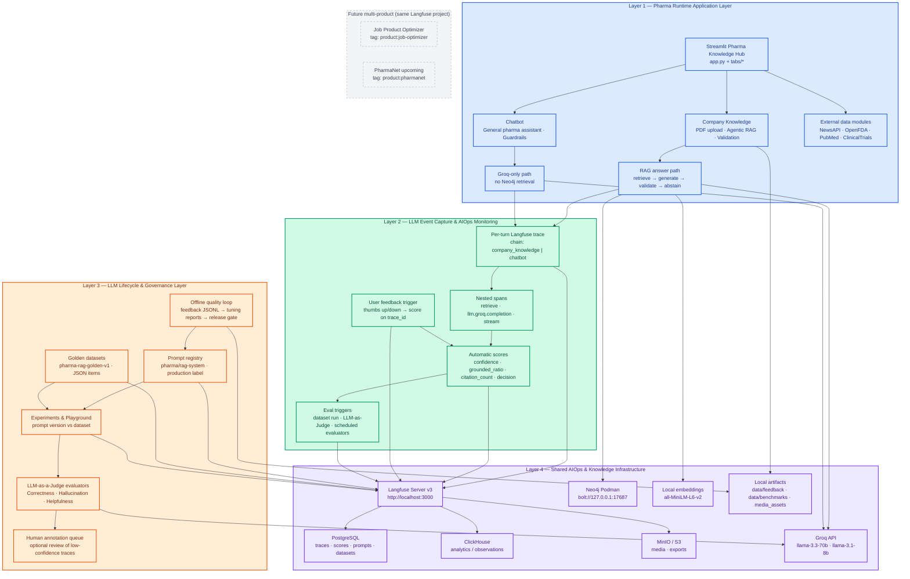
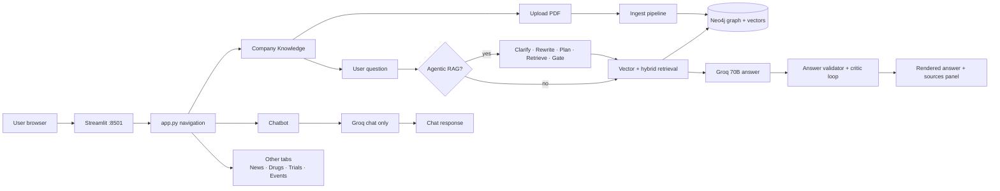
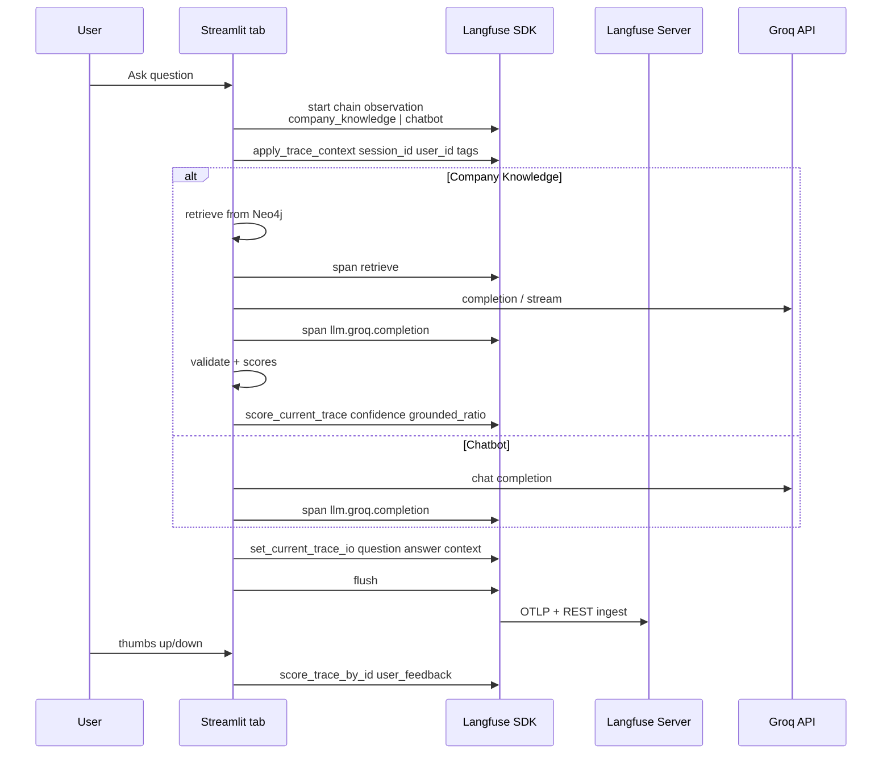
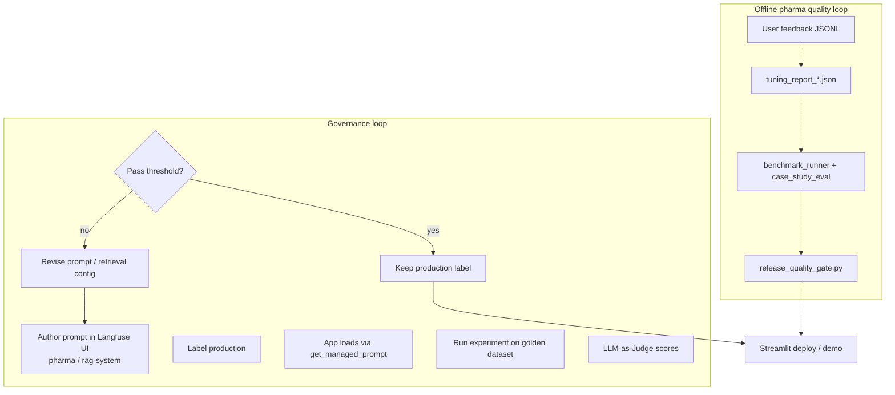
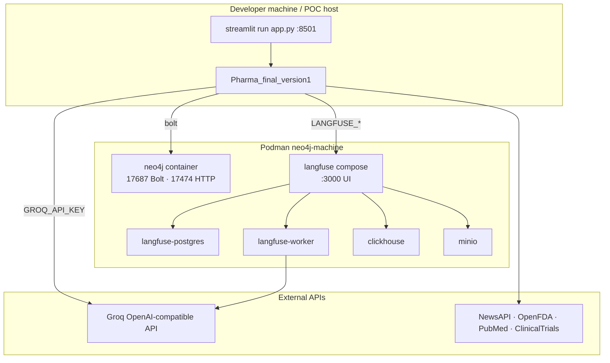
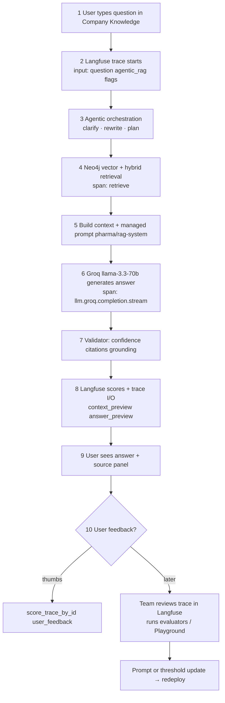
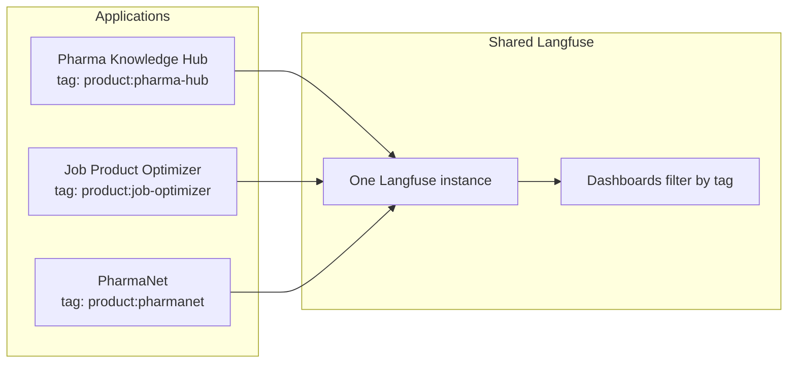

# Langfuse-Based Shared AIOps Architecture for Pharma Knowledge Hub

**LLM tracing, evaluation, prompt governance, RAG monitoring, and multi-product observability** — structured like the MLflow MLOps reference (runtime → capture → lifecycle → shared platform).

---

## 1) Four-layer architecture (main diagram)



---

## 2) MLOps reference → AIOps mapping

| MLflow reference (PdM) | Pharma Knowledge Hub AIOps |
|------------------------|----------------------------|
| PdM Dashboards (Milling UI) | **Streamlit** `app.py` — Company Knowledge, Chatbot, News, Trials, etc. |
| Prediction API Services | **In-process RAG + Groq** (`utils/rag_pipeline.py`, `utils/agentic_rag.py`) |
| Registered production models | **Managed prompt** `pharma/rag-system` + config thresholds (`RAG_CONFIDENCE_THRESHOLD`) |
| Decision output (risk, warnings) | **Answer + validation** — confidence %, citations, abstain, panel trace |
| Inference event buffer | **Langfuse traces** — one trace per user turn, OTel export |
| Monitoring trigger | **Automatic** on each question; optional dataset experiment runs |
| Drift evaluation engine | **LLM-as-Judge** + grounded_ratio / hallucination evaluators |
| Monitoring result | **Scores tab** + evaluator comments; low scores → prompt/threshold tune |
| Training runs | **Prompt versions** + experiment runs on golden dataset |
| Model registry (Staging/Production) | **Prompt labels** (`production`) + config in `config.py` |
| Governance artifacts | **Datasets, eval templates, human scores, tuning reports** |
| MLflow Server + Postgres + MinIO | **Langfuse** + Postgres + ClickHouse + MinIO (Podman compose) |
| SQLite fallback | **Tracing off** if keys missing — app still runs locally |

---

## 3) Layer 1 — Pharma runtime (what users see)



**Key runtime files**

| Component | Path |
|-----------|------|
| Shell / routing | `app.py` |
| Document RAG UI | `tabs/company_knowledge.py` |
| General chat | `tabs/chatbot.py` |
| Ingest + retrieve | `utils/rag_pipeline.py`, `utils/neo4j_manager.py` |
| Agentic orchestration | `utils/agentic_rag.py` |
| Validation | `utils/answer_validator.py` |
| Guardrails | `utils/pharma_guardrails.py` |

---

## 4) Layer 2 — Event capture & monitoring (Langfuse)

Every **Company Knowledge** or **Chatbot** turn opens one trace:



**Instrumentation** (`utils/langfuse_trace.py`)

| Signal | Where set |
|--------|-----------|
| Trace name / chain | `company_knowledge`, `chatbot` |
| Session | `get_session_id("company_knowledge")` |
| Tags | `company_knowledge`, `chatbot` (+ future `product:pharma-hub`) |
| Trace I/O | `set_current_trace_io()` — Preview tab |
| LLM I/O | `complete_groq_chat` / `stream_groq_chat` in `utils/agentic_rag.py` |
| Cost hint | `GROQ_PRICE_*` in `config.py` |

**Health check**

```powershell
python scripts/check_langfuse_connection.py
```

---

## 5) Layer 3 — Lifecycle & governance



| Artifact | Location / tool |
|----------|-----------------|
| Golden Q&A dataset | Langfuse → Datasets → `pharma-rag-golden-v1` |
| Evaluator templates | Langfuse UI or `scripts/seed_langfuse_evaluators.py` |
| User feedback | `data/feedback/rag_feedback.jsonl` |
| Tuning reports | `data/feedback/tuning_report_*.json` |
| Benchmarks | `data/benchmarks/*` |
| Release gate | `tests/release_quality_gate.py` |

---

## 6) Layer 4 — Shared infrastructure (deployment view)



**Daily startup (POC)**

```powershell
podman machine start neo4j-machine
cd C:\Users\mdevaraju\langfuse; podman compose up -d
cd D:\Documents\KN_HUB2\Pharma_final_version1
.\scripts\start_neo4j_podman.ps1
streamlit run app.py
```

---

## 7) End-to-end: one Company Knowledge question



---

## 8) Multi-product AIOps (future unified dashboard)

Same Langfuse **project**, different **tags** and **trace names** — one leadership dashboard.



---

## 9) Key benefits (sidebar — for slides)

| Benefit | How Pharma + Langfuse delivers it |
|---------|-----------------------------------|
| **Centralized LLM governance** | One Langfuse project for prompts, datasets, evaluators, traces |
| **Real-time observability** | Every RAG/chat turn traced with latency and token usage |
| **Grounding visibility** | `grounded_ratio`, `citation_count`, context preview on trace |
| **Human + automatic quality** | Thumbs feedback + LLM-as-Judge + optional annotation queue |
| **End-to-end lineage** | Trace → spans → scores → prompt version → dataset item |
| **Pharma-safe abstain path** | Low confidence → critic → strict abstain with orientation tail |
| **Scalable POC → prod** | Same pattern for Job Optimizer and PharmaNet via tags |

---

## 10) Key messages (footer — for leadership KT)

1. **Runtime always goes through governed paths** — Company Knowledge uses Neo4j retrieval + managed prompt + validation; Chatbot uses domain guardrails without retrieval.
2. **Each inference carries full metadata** — session, user, tags, question, context preview, answer, automatic scores, and optional user feedback on the same `trace_id`.
3. **Langfuse is the AIOps control plane** — tracing, scoring, prompts, datasets, experiments, and judges; offline JSONL/benchmarks close the loop into config and prompt updates (not weight fine-tuning in this POC).

---

## 11) Related docs

- Implementation detail: [`../ARCHITECTURE.md`](../ARCHITECTURE.md)
- Langfuse connection: `scripts/check_langfuse_connection.py`
- Environment template: `.env.example`
